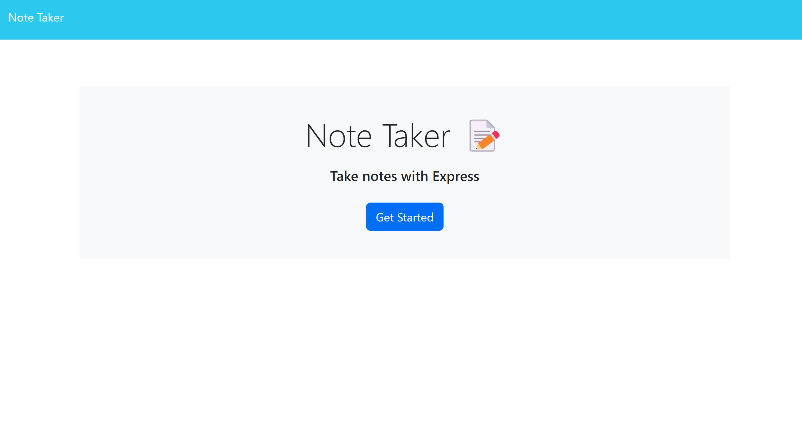

# Note-Taker
  

  ## Description
  a platform where I can create notes, delete notes and view all the notes that were created

  ## Table of Contents 
  - [Installation](#installation)
  - [Usage](#usage)
  - [License](#license)
  - [Contributing](#contributing)
  - [Questions](#questions)

  ## Installation
  Check out the deployed application here: https://notes-tracker-e6327ed268d1.herokuapp.com/

  ## Usage
  
  

  ## License
  This project is licensed under MIT.

  ## Contributing
  create a pull request

  ## Tests
  NA

  ## Questions
  If you have any questions about this project you can reach me at .

  To view more of my Projects go to https://github.com/MalkaGreenberg.
